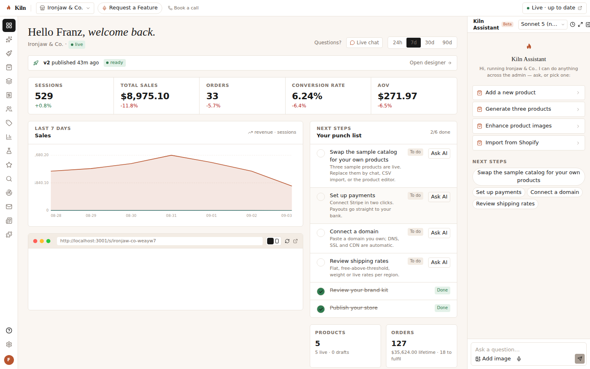
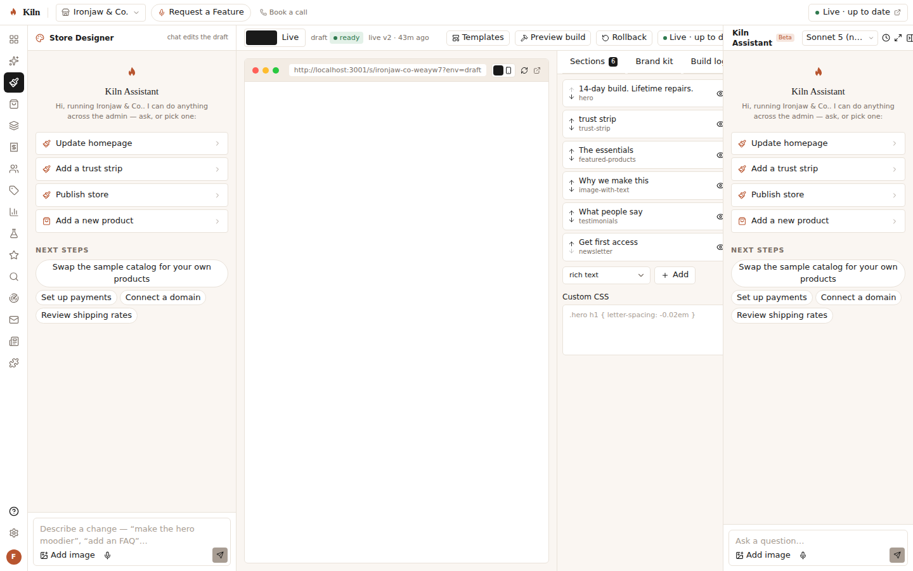
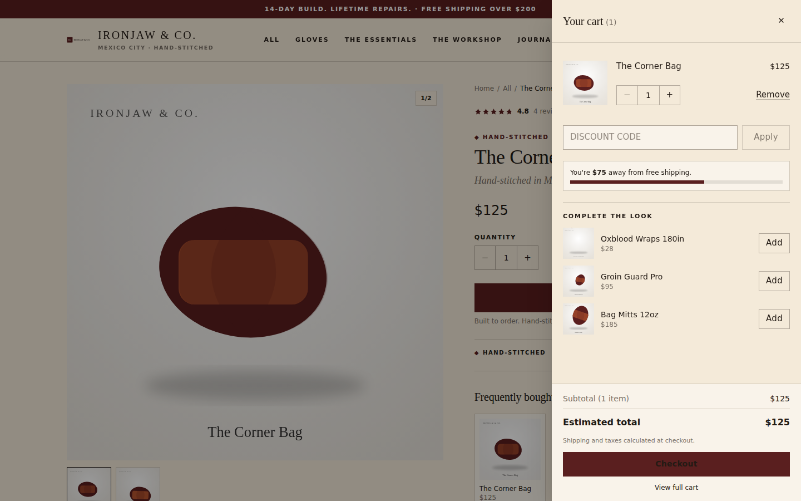

<p align="center">
  
</p>

<h1 align="center">Kiln</h1>
<p align="center"><em>Say what you sell. Kiln fires the store.</em></p>

Kiln is an **AI-native, multi-tenant shop system** — a Shopify replacement where the whole stack (storefront, commerce backend, payments, transactional + marketing email, domain) is one platform, and an **agentic assistant sits on every admin page** executing real, validated tool calls rather than answering questions.

Type one sentence → Kiln names the brand, builds the kit, writes and publishes three products with images, sets up promotions, and puts a storefront live. Then you run the store by talking to it.

```
"Create me a hand-stitched boxing-gear store in the style of a 1920s heritage leather atelier"
        │
        ▼
 naming → brand kit → 3 products (copy · variants · images) → collections → promotions → build → LIVE
```

## A look

| Admin dashboard | Store Designer |
|---|---|
|  |  |

| Generated storefront | Product page + cart |
|---|---|
|  |  |

*Every pixel above came from one sentence and the demo seed — no API keys.*

## What's inside

| Surface | Package | What it is |
|---|---|---|
| Control plane + commerce engine | `apps/core` | Hono API: auth (JWT + refresh), orgs/stores/environments (draft/live), products/variants/inventory, collections (manual + smart), customers + segments, carts + **pricing engine** (codes, automatic, BOGO, bundle tiers, free-ship thresholds, stacking rules, regional tax), checkout → orders → fulfilments/returns/refunds, subscriptions + dunning, promotions, gift cards, multi-region + currency conversion, shipping rates (flat/free-above/weight/price/pickup/local), reviews (fake filter, AI summary, Q&A), A/B experiments (Bayesian), analytics (cookie-less sessions, funnel vs benchmarks, realtime, cohorts), SEO (auto meta/JSON-LD, issues scan, sitemap, redirects), GEO (knowledge card, `llms.txt`, prompt tracking), blog, campaigns + 5 flows, workflow automation, plugins + encrypted credentials, domains + DNS verification, team/RBAC, billing (Stripe optional), migration CSV importer (Shopify/Woo/BigCommerce/Magento/Squarespace). |
| Agent runtime | `packages/agent` | Zod tool registry → JSON Schema, Anthropic tool-use loop with **durable, resumable runs**, risky-tool confirmation + autonomy grants, model router, and a deterministic **offline planner** so everything works with no API key. |
| AI layer | `apps/core/src/ai` | 80+ tools across products, collections, promotions, orders, customers, designer, plugins, analytics, emails, blog, reviews, SEO/GEO, experiments, setup wizards; plugin-contributed tools; onboarding orchestrator with parallel branches; brand/product/copy generators; 4-lane image generation (OpenAI or branded SVG art). |
| Admin | `apps/admin` | Next.js 15: icon rail, docked AI panel with live activity dots, dashboard, Store Designer (chat + live preview), every commerce/growth page, settings, mobile shell. |
| Storefront | `apps/storefront` | Next.js 15 multi-tenant storefront (subdomain, path, or custom domain), theme sections, plugin **slot system**, PDP anatomy from the blueprint, cart drawer with free-ship gap closer, 4-step checkout (Stripe Payment Element or test provider), post-purchase one-click upsell, reviews wall, accounts + subscription portal, blog, SEO/GEO files. |
| Plugins | `packages/plugins` | Manifest schema + 30 first-party plugins (reviews, upsells, exit intent, contact form, blog, engraving, workflows, GA4, Meta, TikTok, Klaviyo, Mailchimp, Shippo, ShipStation, ShipBob, Skydropx, Shiprocket, Royal Mail, Razorpay, Mollie, Adyen, Paystack, Google Shopping/Ads, FB Shop, Tidio, sevDesk, GoAffPro, Printful, CJ) + a third-party directory. |
| Email | `packages/email` | 10 transactional templates (Handlebars over a brand-tokenised layout), Resend transport with 3× retry + audit log, console transport for dev. |
| Data | `packages/db` | Drizzle schema (60 tables), migrations, **PGlite** for zero-config dev, Postgres in production. |
| Shared | `packages/shared` | Domain types, storefront slot names, config-driven plans, theme templates. |

## Quick start

```bash
pnpm install
cp .env.example .env            # everything optional; no keys needed for demo mode
pnpm seed                       # demo workspace: franz@kiln.local / kiln-demo + "Ironjaw & Co." with 28 days of data
pnpm dev                        # core :4000 · admin :3000 · storefront :3001
```

Open http://localhost:3000, log in, and talk to the store. Or register and type your own sentence at `/onboarding`.

- **No API keys** → the offline planner drives the assistant and onboarding deterministically; images are branded SVG art; emails log to the console; payments use the test provider.
- Add `ANTHROPIC_API_KEY` → real model-driven runs (Claude routes per task; merchants pick the model). Add `OPENAI_API_KEY` → real image lanes. Add `STRIPE_SECRET_KEY` (+ Connect client id) → Stripe Connect + Payment Element. Add `RESEND_API_KEY` → real email. Set `DATABASE_URL` → Postgres (see `docker-compose.yml`).

## Scripts

| Command | Does |
|---|---|
| `pnpm dev` / `pnpm dev:core` / `pnpm dev:admin` / `pnpm dev:storefront` | run apps |
| `pnpm test` | vitest across packages (core has an end-to-end suite that boots the API on in-memory PGlite) |
| `pnpm typecheck` / `pnpm build` | strict TS + Next builds |
| `pnpm db:generate` | regenerate SQL migrations from `packages/db/src/schema.ts` |
| `pnpm seed` | demo data (idempotent) |
| `node scripts/smoke.mjs` | browser smoke test against running apps (login → every admin page → assistant run → storefront → cart); needs Chromium via `CHROME_PATH` |

## Try the assistant (works offline)

```
add a product called Oxblood Wraps 120in for $24 in sizes S, M, L
create discount code SUMMER20 for 20% off
free shipping over $150
buy 3 and save 15%
change the homepage headline to Built for real rounds
install the GA4 plugin
review analytics
refund order #1001 $5        ← pauses for confirmation (risky tool) unless granted
publish the store
```

## Architecture

See [`docs/ARCHITECTURE.md`](docs/ARCHITECTURE.md) for the request flow, the agent loop, the build/publish pipeline, multi-tenancy and how plugins contribute tools and storefront components. [`docs/API.md`](docs/API.md) indexes every endpoint.

## License

MIT
